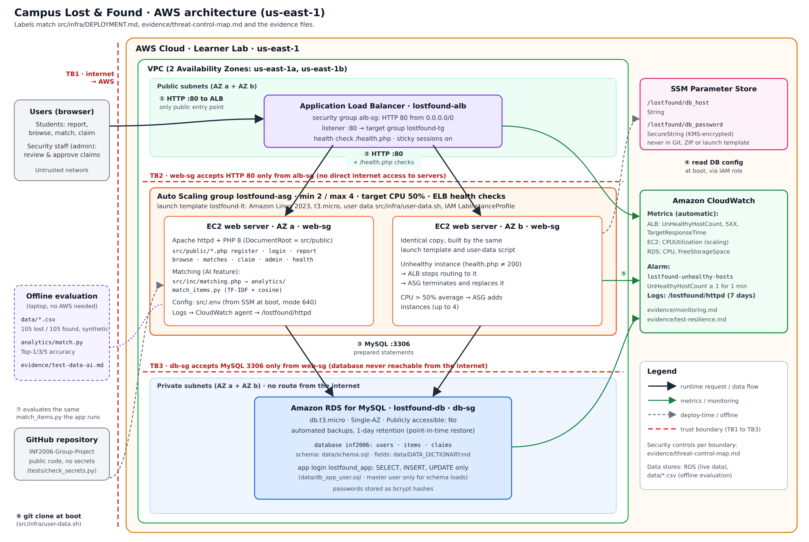

# Campus Lost & Found

**INF2006 Cloud Computing & Big Data, Team Project 1 · Team 10**

A cloud-hosted web app where SIT students and staff report lost and found items, browse what has
been handed in, get automatically ranked matches for a lost item, and claim it. Security staff
verify every claim before an item is released.

## Problem statement

SIT has no designated lost-and-found service. Finders hand items to Security on patrol or at the
W3 Security Room, and owners must visit or email Security to ask whether their item has turned up.
Notices are scattered across chat groups and noticeboards, so owners don't know where to look,
finders don't know whom to tell, and Security has no searchable record. Campus Lost & Found gives
everyone one place to report and search, compares each lost report against every open found report
to show ranked matches with a match percentage, and records ownership claims that Security checks
against a private detail only the real owner would know.

## Team

| Name | Student ID | Role |
|---|---|---|
| Chern De Qian | 2502760 | *(see TEAM_CONTRIBUTIONS.md)* |
| Teo Siow Min Glenda | 25018130 | |
| Zhou Xinlong | 2500775 | |
| Liew Jia Rong | 2501090 | |
| Ruan Zhongjiang | 2501780 | |
| Thiha Thein | 2502266 | |

## Architecture



Users reach an **Application Load Balancer** (`lostfound-alb`) that spreads traffic over an
**Auto Scaling group** (`lostfound-asg`) of EC2 web servers in two Availability Zones. Each server
runs Apache + PHP (`src/`) and the Python matching script (`analytics/match_items.py`). Data lives
in **Amazon RDS for MySQL** (`lostfound-db`) in private subnets. Database settings come from
**SSM Parameter Store** at boot. **CloudWatch** collects metrics, logs and the health alarm.
Details: `src/infra/DEPLOYMENT.md`. Machine-readable summary: `project_manifest.yaml`.

## Quick start (local, no AWS needed)

Requirements: PHP 8 with `mysqli`, MySQL/MariaDB, Python 3.9+. On Windows, XAMPP provides PHP,
Apache and MariaDB.

```bash
# 1. Python packages (matching feature + tests)
pip install -r analytics/requirements.txt -r tests/requirements.txt

# 2. Reproduce the data/AI evaluation (no database needed)
python3 analytics/match.py

# 3. Database (or import data/schema.sql into a new database "inf2006" in phpMyAdmin)
mysql -u root -e "CREATE DATABASE inf2006"
mysql -u root inf2006 < data/schema.sql

# 4. Configuration: copy the template and set your local DB login
cp src/.env.example src/.env        # Windows: copy src\.env.example src\.env

# 5. Run the app (or serve src/public with XAMPP's Apache)
php -S 127.0.0.1:8080 -t src/public
# open http://127.0.0.1:8080/register.php
# demo admin: admin@sit.singaporetech.edu.sg / admin123 (testing only)

# 6. Run the functional + security tests against it
python3 tests/run_tests.py http://127.0.0.1:8080
python3 tests/check_secrets.py
```

Deploying to AWS: follow `src/infra/DEPLOYMENT.md` (expected cost about US$0.06–0.07 per hour
while running; delete everything afterwards as described there).

## Repository map

| Path | Contents |
|---|---|
| `src/public/` | PHP pages: register, login, dashboard, report lost/found, browse, matches, claim, my claims, admin, health check |
| `src/inc/` | Shared PHP: database connection (`db.php`), sessions and roles (`auth.php`), matching bridge (`matching.php`) |
| `src/.env.example` | Configuration template (placeholders only) |
| `src/infra/` | EC2 launch script (`user-data.sh`) and AWS deployment guide |
| `analytics/` | Matching script used by the app, offline evaluation, requirements, README |
| `data/` | Database schema, least-privilege DB user, synthetic dataset and generator, data dictionary |
| `tests/` | Automated functional and security tests, secrets scan, password-hash check |
| `evidence/` | Architecture diagram, the 4 required test records, monitoring, deployment record, threat-control map |
| `project_manifest.yaml` | Machine-readable index of everything above |

## Evidence

| Required test | Record | How to reproduce |
|---|---|---|
| 1. Functional workflow | `evidence/test-functional.md` | `python3 tests/run_tests.py <url>` |
| 2. Security control | `evidence/test-security.md` | same command + `tests/check_secrets.py` + `tests/check_password_hashes.sql` |
| 3. Data / AI validation | `evidence/test-data-ai.md` | `python3 analytics/match.py` |
| 4. Scalability / resilience | `evidence/test-resilience.md` | AWS procedure in that file |
| Monitoring | `evidence/monitoring.md` | CloudWatch alarm + log query in that file |

## Technology

| Layer | Technology |
|---|---|
| Web app | PHP 8, Apache httpd, HTML/CSS (no framework) |
| Matching (AI/analytics) | Python 3, scikit-learn (TF-IDF + cosine similarity), pandas for evaluation |
| Database | MySQL 8 on Amazon RDS (MariaDB locally) |
| Compute | Amazon EC2 (Amazon Linux 2023, t3.micro), Auto Scaling group, launch template |
| Network | VPC with public/private subnets in 2 AZs, Application Load Balancer, security groups |
| Secrets | SSM Parameter Store (SecureString), `.env` file outside the web root |
| Monitoring | Amazon CloudWatch metrics, alarm, Logs (via CloudWatch agent) |
| Testing | Python `requests` (HTTP tests), SQL check, secrets scanner |

## Known limitations

- **Matching always suggests something.** Items of the same category share enough words to pass
  the 20% threshold, so even a lost item that was never handed in gets suggestions. Every claim is
  checked by Security, so a wrong suggestion can't release an item. (`evidence/test-data-ai.md`)
- **HTTP only.** No TLS certificate in the Learner Lab; production would add an HTTPS listener with
  ACM.
- **Sessions are stored on each server** and rely on ALB sticky sessions. A user on a server that
  is replaced has to log in again. Production fix: store sessions in the database or ElastiCache.
- **No CSRF tokens and no login rate limiting** (documented in `evidence/test-security.md`).
- **Single-AZ database** to save cost: backups allow recovery, but not automatic failover.
- **Synthetic evaluation data** only; accuracy on real reports is untested.
- **Photo matching** was considered and not built (needs S3 and image models).
